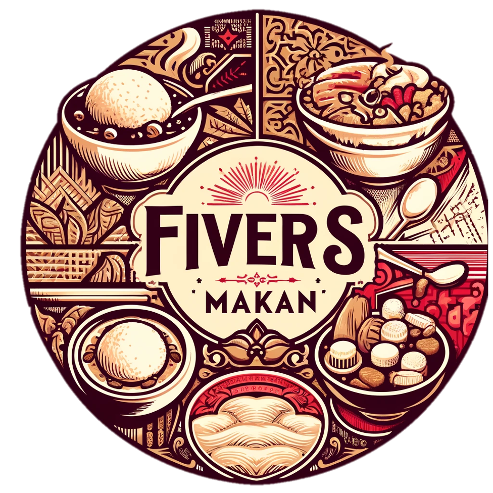

# 🥘😋 SC2006-Fiver's Makan

> Project for SC2006 -> Find Foods matching your dietary needs



## Getting Started

> From your command line, go the your working directory and run the following scripts in the terminal

1\. Go to Working Directory

```terminal
cd <WORKING-FOLDER-NAME>
```

2\. Clone our repo

```terminal
git clone https://github.com/softwarelab3/2006-SCEC-Fivers.git
```

3\. Go to Project Directory
```terminal
cd sc2006-project-main
```

4\. Change Directory to `frontend` or `backend`

```terminal
cd <PROJECT-PATH>
```

4\.1 Initialise Modules and Start `frontend`
```terminal
#frontend> npm i
#frontend> npm start
```

4\.2 Initialize Modules and Start `backend`
```terminal
#backend> npm i
#backend> npm run dev
```

## 📂 Project Folder Structure

#### Top Level Directory Layout

```terminal
.
├── Lab Documentation   # lab deliverables & Documentation
├── sc2006project-main  # Main SC2006 Fiver's Makan Root
│    ├── backend        # Express.js Backend
│    ├── frontend       # React native app   
├── .gitignore
└── README.md
```

## 🧪 Tech Stack
<p>
    
    
    
    
</p>

## Contributors - Team Fivers

- [@notsuspiciousindividual](https://github.com/notsuspiciousindividual)
- [@kylerlim](https://github.com/kylerlim)
- [@weijunnlim](https://github.com/weijunnlim)
- [@JodiusLow](https://github.com/JodiusLow)
- [@cheechengm](https://github.com/cheechengm)
